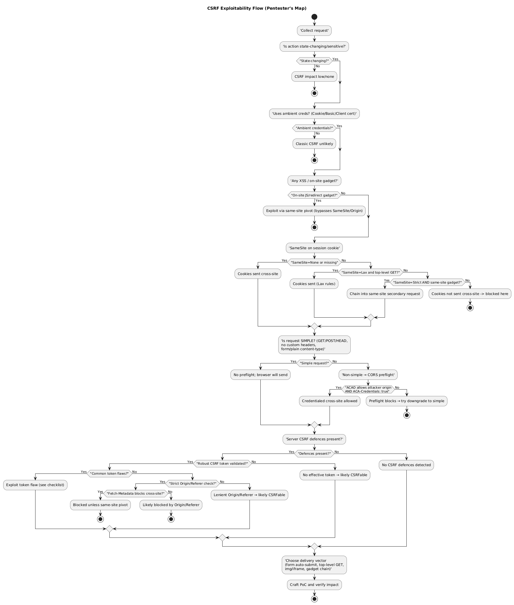

Diagram source: [diagram.puml](csrf-decision-map.puml)

This diagram provides a structured way for penetration testers to evaluate whether a given HTTP request is **vulnerable to Cross-Site Request Forgery (CSRF)**.
Start from any captured request and follow the branches.
At each decision point, check the condition on the request or response and continue accordingly.

---

### 1. Collect the request

Record all relevant details:

* Full method, URL, and parameters.
* Request headers (`Cookie`, `Origin`, `Referer`, `Sec-Fetch-*`, `Content-Type`).
* Response headers (`Access-Control-*`, `Set-Cookie`).
* Authentication mechanism (session cookie, HTTP Basic, client certificate, token).
* How the action can be triggered (form, link, JS, API).

---

### 2. Is the action state-changing?

CSRF only matters for **state-changing** or **sensitive** actions – creating, deleting, modifying, or performing privileged tasks (e.g., password change, funds transfer).
If the request is purely read-only, CSRF risk is negligible.

---

### 3. Does the action rely on ambient credentials?

Check whether the server authenticates users using **browser-supplied credentials**:

* Session cookie
* Basic/Digest authentication
* Client certificate

If authentication is handled by an explicit bearer token in the request body or header that an attacker cannot guess, classic CSRF is unlikely.

---

### 4. Any on-site JavaScript or redirect gadgets?

If the application or any sibling subdomain has an XSS or client-side redirect that can issue internal requests, these can be chained to **bypass SameSite, Origin, or Fetch-Metadata** protections.
In that case, treat the site as **CSRF-exploitable** regardless of other defences.

---

### 5. Check SameSite attribute on session cookies

Inspect `Set-Cookie` headers:

| SameSite value   | Browser behaviour                               | CSRF implication                           |
| ---------------- | ----------------------------------------------- | ------------------------------------------ |
| **None; Secure** | Cookies sent in all cross-site requests         | CSRF possible                              |
| **Lax**          | Cookies sent only for top-level GET navigations | Use GET or method-override to test         |
| **Strict**       | Cookies never sent cross-site                   | Needs on-site or same-site redirect gadget |

Modern browsers default to **Lax-by-default**, with a short (~2-minute) window where newly issued cookies behave as `Lax` even for POST requests.

---

### 6. Determine whether the request is *simple* or *non-simple*

**Simple requests** (no CORS preflight)

* Methods: `GET`, `HEAD`, `POST`
* Headers: only default ones
* Content-Type: `application/x-www-form-urlencoded`, `multipart/form-data`, or `text/plain`

These can be sent cross-site automatically and are **CSRF-prone**.

**Non-simple requests** (trigger CORS preflight)

* Custom headers or content types like `application/json`
* Browser sends an `OPTIONS` preflight to verify allowed methods/headers.
* If the target does **not** respond with
  `Access-Control-Allow-Origin: <attacker>` **and**
  `Access-Control-Allow-Credentials: true`,
  the browser will **not send** the actual request.
  → In such cases, CSRF fails unless CORS is overly permissive.

---

### 7. Look for CSRF defences

#### CSRF tokens

Check whether a token is required and validated.
Common bypassable flaws:

| Flaw                              | Exploit idea                         |
| --------------------------------- | ------------------------------------ |
| Validation skipped for GET        | Change method to GET                 |
| Token optional                    | Remove the parameter entirely        |
| Token not bound to session        | Use your own valid token             |
| Token bound to non-session cookie | Overwrite that cookie from subdomain |
| Double-submit cookie = param      | Set both to same value               |
| Token reused                      | Replay                               |
| Token leaked in Referer           | Capture and reuse                    |

#### Origin / Referer checks

If the server validates these headers, test whether:

* Subdomain or scheme variations are accepted (`https://app.example.com` vs `https://intranet.example.com`).
* Redirects or stripped headers bypass the check.
  Lenient matches (“contains example.com”) are exploitable.

#### Fetch-Metadata (`Sec-Fetch-Site`)

If enforced, `cross-site` requests will be dropped unless you can pivot through a same-site gadget.
If absent, proceed.

---

### 8. Choose a delivery vector

Depending on what passed above, pick the appropriate mechanism:

| Vector                   | Works with                 | Example                                               |
| ------------------------ | -------------------------- | ----------------------------------------------------- |
| Auto-submitted `<form>`  | Simple POST                | Hidden form with JavaScript `.submit()`               |
| `` / `<iframe>`     | GET endpoints              | ``                         |
| Top-level navigation     | SameSite=Lax bypass        | `<a href="...">` or `document.location`               |
| Gadget chain             | SameSite=Strict bypass     | Redirect or on-site script call                       |
| Popup SSO refresh → POST | Lax 2-minute cookie window | `window.open('https://target/login/sso')` then submit |

---

### 9. Craft PoC and verify

Build the CSRF proof of concept with the appropriate form or script.
Load it while authenticated as the victim and observe whether the intended action executes successfully.
Confirm impact and document mitigation recommendations (CSRF token, SameSite, Fetch-Metadata).

---

### Quick summary table

| Layer            | What to check         | Blocks CSRF?       | How to test                   |
| ---------------- | --------------------- | ------------------ | ----------------------------- |
| SameSite cookie  | `Lax` / `Strict`      | Partial / Yes      | Inspect `Set-Cookie`          |
| Request type     | Simple / Non-simple   | No / Yes           | Check content type & headers  |
| CORS preflight   | ACAO & creds          | Only if permissive | Look at `OPTIONS` response    |
| CSRF token       | Validated per session | Yes                | Tamper or reuse               |
| Origin / Referer | Strict match          | Yes                | Modify header or redirect     |
| Fetch-Metadata   | `cross-site` blocked  | Yes                | Check `Sec-Fetch-Site` policy |
